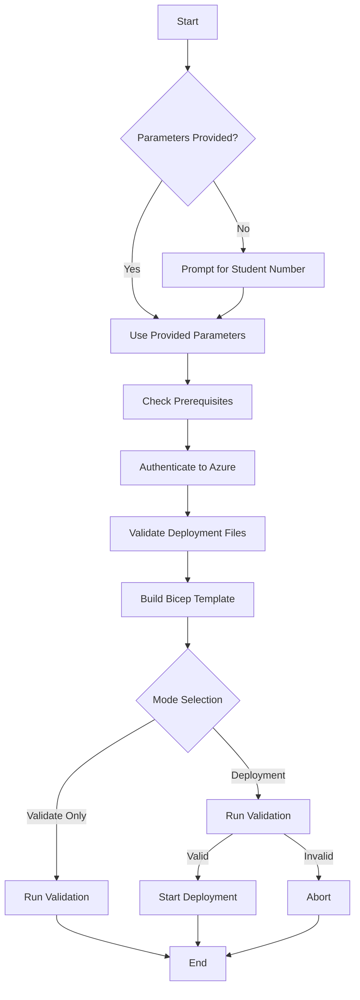

# Script Execution Flow: `deploy.ps1`

This document outlines the step-by-step execution logic of the `deploy.ps1` PowerShell script located in `W365LandingZone/2_Spoke/`.

## High-Level Flow

The script follows a sequential process to ensure prerequisite checks, authentication, and validation occur before any resources are deployed to Azure.

## Detailed Steps

### 1. Parameter Initialization
*   **Input**: The script accepts parameters like `-StudentNumber`, `-Location`, `-TenantId`, `-SubscriptionId`, `-Validate`, and `-WhatIf`.
*   **Interactive Prompt**: If `StudentNumber` is not provided via command line, the script interactively prompts the user to enter a number between 1-40.
*   **Calculation**: Based on the student number, it calculates the unique IP address space (e.g., Student 5 -> `192.168.5.0/24`).

### 2. Prerequisite Checks (`Test-AzModuleInstalled`)
*   Verifies that the **Azure PowerShell module (Az)** is installed.
*   If missing, it halts execution and instructs the user to install it.

### 3. Authentication & Context (`Select-AzureTenantContext`)
*   **Status Check**: Checks if the user is already logged into Azure.
*   **Tenant Selection**:
    *   If `-TenantId` is provided, it attempts to use that specific tenant.
    *   If multiple tenants are available and no ID is provided, it lists them and prompts the user to select one.
*   **Subscription Selection**:
    *   If `-SubscriptionId` is provided, it targets that subscription.
    *   If multiple subscriptions exist, it lists them and prompts for selection.
*   **Context Switch**: Sets the active Azure context to the selected Tenant and Subscription to ensure resources are deployed to the correct place.

### 4. File Validation (`Test-DeploymentFiles`)
*   Checks for the existence of the Bicep template (`main.bicep`) and the parameters file (`parameters.prod.json`).
*   Ensures the paths are correct before attempting to build.

### 5. Bicep Build (`Build-BicepTemplate`)
*   Attempts to compile the `.bicep` file into an ARM JSON template (`main.json`) using the Bicep CLI (`az bicep build`).
*   **Fallback**: If Bicep CLI fails or is missing, it sets the script to use the raw `.bicep` file (allowing Azure to handle the compilation server-side if supported/configured).

### 6. Template Validation (`Test-Deployment`)
Before deploying, the script performs a "dry run" validation:
*   **Service Principal Check**: Retrieves the Object ID for the Windows 365 service principal in the tenant (required for permissions).
*   **Parameter Assembly**: Merges the file-based parameters with the script-calculated parameters (Student Number, Service Principal ID).
*   **Azure Validation**: Runs `Test-AzSubscriptionDeployment`. This sends the template to Azure Resource Manager to check for syntax errors, quota issues, or policy violations without creating resources.

### 7. Deployment Execution (`Start-Deployment`)
If not in `-Validate` mode, and validation passes:
*   **Quota Check**: Runs `Test-VNetQuota` to ensure the resource group doesn't already have a VNet (preventing accidental duplicates or conflicts in a lab environment).
*   **Deployment**:
    *   **What-If Mode**: If `-WhatIf` switch is used, it runs a What-If analysis to show predicted changes.
    *   **Standard Mode**: Executes `New-AzSubscriptionDeployment` to provision the resources.
*   **Output**: Displays the deployment status (Succeeded/Failed) and any output values (Resource Group Name, VNet ID, etc.).

## Error Handling
The script uses `try/catch` blocks throughout to gracefully handle errors:
*   **Authentication Failures**: Prompts for re-login or MFA.
*   **Validation Errors**: Displays specific error messages from the Azure Resource Manager.
*   **Deployment Failures**: Captures and displays the error message and stack trace for troubleshooting.
