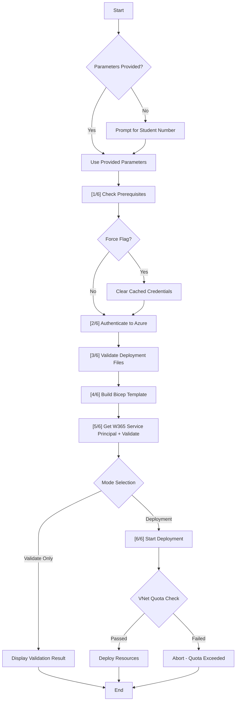

# Script Execution Flow: `deploy.ps1`

This document outlines the step-by-step execution logic of the `deploy.ps1` PowerShell script located in `W365LandingZone/2_Spoke/`.

## Usage

### Basic Execution
```powershell
.\deploy.ps1
```

### Parameters

| Parameter | Description |
|-----------|-------------|
| `-StudentNumber` | Student number (1-40) for unique IP addressing. If omitted, prompts interactively. |
| `-WhatIf` | Preview changes without deploying. |
| `-Validate` | Validate template syntax only. |
| `-Location` | Azure region (Default: `southcentralus`). |
| `-TenantId` | Specific Tenant ID (skips interactive selection). |
| `-SubscriptionId` | Specific Subscription ID (skips interactive selection). |
| `-Force` | Clears all cached Azure credentials before authentication. Use when redirected to wrong tenant. |

**Examples:**
```powershell
# Interactive deployment
.\deploy.ps1

# Specific student with preview
.\deploy.ps1 -StudentNumber 5 -WhatIf

# Force fresh login
.\deploy.ps1 -Force -StudentNumber 3

# Non-interactive deployment
.\deploy.ps1 -TenantId "GUID" -SubscriptionId "GUID" -StudentNumber 10
```

## High-Level Flow

The script follows a sequential 6-step process to ensure prerequisite checks, authentication, and validation occur before any resources are deployed to Azure.



## Detailed Steps

### 1. Parameter Initialization & Student Number Prompt
*   **Input**: The script accepts parameters: `-StudentNumber`, `-Location`, `-TenantId`, `-SubscriptionId`, `-Validate`, `-WhatIf`, and `-Force`.
*   **Interactive Prompt**: If `StudentNumber` is not provided via command line, the script interactively prompts the user to enter a number between 1-40 with input validation.
*   **Calculation**: Based on the student number, it calculates the unique IP address space (e.g., Student 5 -> `192.168.5.0/24`).

### 2. [1/6] Prerequisite Checks (`Test-AzModuleInstalled`)
*   Verifies that the **Azure PowerShell module (Az)** is installed.
*   If missing, it halts execution and instructs the user to install it.

### 3. [2/6] Authentication & Context (`Select-AzureTenantContext`)
*   **Force Login**: If `-Force` is specified, clears all cached Azure credentials using `Disconnect-AzAccount` and `Clear-AzContext` before proceeding. This is useful when being redirected to the wrong tenant.
*   **Status Check**: Checks if the user is already logged into Azure.
*   **Tenant Selection**:
    *   If `-TenantId` is provided, it attempts to use that specific tenant.
    *   If multiple tenants are available and no ID is provided, it lists them and prompts the user to select one.
    *   Single tenant is auto-selected.
*   **Subscription Selection**:
    *   If `-SubscriptionId` is provided, it targets that subscription.
    *   If multiple subscriptions exist, it lists them and prompts for selection.
    *   Single subscription is auto-selected.
*   **Context Switch**: Sets the active Azure context to the selected Tenant and Subscription to ensure resources are deployed to the correct place.

### 4. [3/6] File Validation (`Test-DeploymentFiles`)
*   Checks for the existence of the Bicep template (`main.bicep`) and the parameters file (`parameters.prod.json`).
*   Ensures the paths are correct before attempting to build.

### 5. [4/6] Bicep Build (`Build-BicepTemplate`)
*   Displays the Bicep CLI version if available.
*   Attempts to compile the `.bicep` file into an ARM JSON template (`main.json`) using the Bicep CLI (`az bicep build`).
*   **Fallback**: If Bicep CLI fails or is missing, it sets the script to use the raw `.bicep` file (allowing Azure to handle the compilation server-side if supported/configured).

### 6. [5/6] Windows 365 Service Principal & Validation (`Get-Windows365ServicePrincipal`, `Test-Deployment`)
*   **Service Principal Lookup**: Retrieves the Object ID for the Windows 365 service principal using the well-known Application ID (`0af06dc6-e4b5-4f28-818e-e78e62d137a5`). This is required for RBAC assignments.
*   **Parameter Assembly**: Merges the file-based parameters with the script-calculated parameters (Student Number, Service Principal ID).
*   **Azure Validation**: Runs `Test-AzSubscriptionDeployment`. This sends the template to Azure Resource Manager to check for syntax errors, quota issues, or policy violations without creating resources.

### 7. [6/6] Deployment Execution (`Start-Deployment`)
If not in `-Validate` mode, and validation passes:
*   **VNet Quota Check** (`Test-VNetQuota`): Enforces a **maximum of 1 VNet per resource group** to prevent accidental duplicates in the lab environment.
    *   If quota exceeded, displays existing VNets and provides removal command.
    *   Aborts deployment if quota is violated.
*   **Deployment**:
    *   **What-If Mode**: If `-WhatIf` switch is used, it runs a What-If analysis to show predicted changes.
    *   **Standard Mode**: Executes `New-AzSubscriptionDeployment` to provision the resources.
*   **Output**: Displays the deployment status (Succeeded/Failed) and any output values (Resource Group Name, VNet ID, etc.).

## Error Handling
The script uses `try/catch` blocks throughout to gracefully handle errors:
*   **Authentication Failures**: Prompts for re-login or MFA. Suggests using `-Force` flag if redirected to wrong tenant.
*   **Validation Errors**: Displays specific error messages from the Azure Resource Manager, including inner exceptions.
*   **VNet Quota Exceeded**: Displays existing VNets and provides `Remove-AzVirtualNetwork` command to clean up.
*   **Missing W365 Service Principal**: Warns that the tenant may not have Windows 365 licenses provisioned.
*   **Deployment Failures**: Captures and displays the error message, inner exception, and stack trace for troubleshooting.

## Troubleshooting

| Issue | Solution |
|-------|----------|
| Redirected to wrong tenant | Use `-Force` flag to clear cached credentials |
| MFA/Authentication errors | Run `Connect-AzAccount -TenantId <id>` manually first |
| VNet quota exceeded | Delete existing VNet with `Remove-AzVirtualNetwork` command shown |
| W365 service principal not found | Ensure tenant has Windows 365 licenses |
| Bicep compilation fails | Run `az bicep upgrade` or `az bicep install` |
| Validation errors | Check parameter file syntax and permissions |
