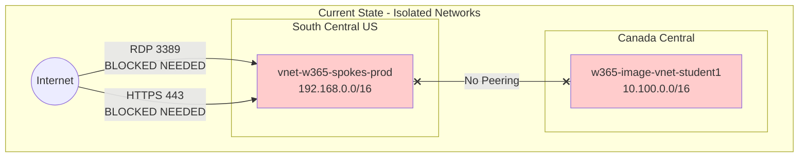
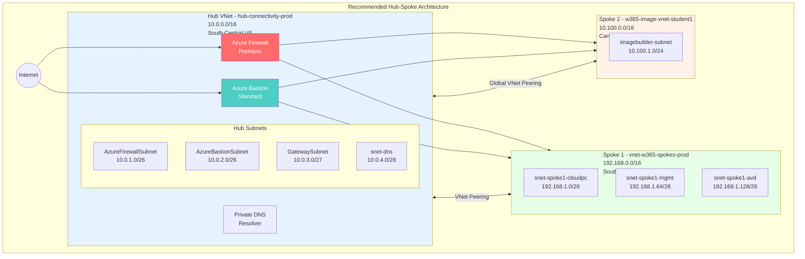
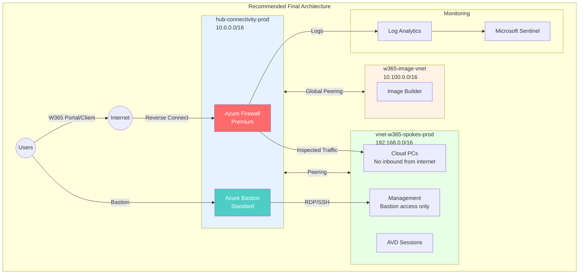

# Hub and Spoke Network Recommendations

**Tenant:** Big Hat Group (bighatgroup.onmicrosoft.com)
**Date:** 2026-02-01
**Purpose:** Address network architecture gaps for Windows 365 and general Azure workloads

---

## Executive Summary

The current network configuration uses a naming convention suggesting hub-spoke architecture (`vnet-w365-spokes-prod`) but lacks the actual hub network and peering infrastructure. Additionally, several NSG rules expose management and workload subnets directly to the internet, creating unnecessary security risks.

This document provides recommendations to implement a proper hub-spoke topology aligned with Microsoft's Cloud Adoption Framework.

---

## Current State Assessment

### Network Topology Issues



### Security Findings

| Severity | Resource | Issue | Risk |
|----------|----------|-------|------|
| **Critical** | nsg-spoke1-cloudpc | RDP 3389 inbound from Any | Direct attack vector; unnecessary for W365 |
| **Critical** | nsg-spoke1-mgmt | HTTPS 443 inbound from Any | Exposes management plane to internet |
| **High** | Architecture | No hub network exists | No centralized security controls |
| **High** | Architecture | No VNet peering | Isolated networks, no shared services |
| **Medium** | Architecture | No Azure Firewall | No traffic inspection or logging |
| **Medium** | Architecture | No Azure Bastion | No secure management access method |

---

## Recommended Architecture

### Target Hub-Spoke Topology



### Address Space Planning

| Network | Address Space | Region | Purpose |
|---------|---------------|--------|---------|
| hub-connectivity-prod | 10.0.0.0/16 | South Central US | Centralized connectivity and security |
| vnet-w365-spokes-prod | 192.168.0.0/16 | South Central US | Windows 365 production workloads |
| w365-image-vnet-student1 | 10.100.0.0/16 | Canada Central | Image building (dev/test) |

### Hub Subnet Design

| Subnet | Address Range | Size | Purpose |
|--------|---------------|------|---------|
| AzureFirewallSubnet | 10.0.1.0/26 | 64 IPs | Azure Firewall (required name) |
| AzureBastionSubnet | 10.0.2.0/26 | 64 IPs | Azure Bastion (required name) |
| GatewaySubnet | 10.0.3.0/27 | 32 IPs | VPN/ExpressRoute Gateway (required name) |
| snet-dns | 10.0.4.0/28 | 16 IPs | Private DNS Resolver endpoints |
| snet-shared-services | 10.0.5.0/24 | 256 IPs | Domain controllers, management tools |

---

## Implementation Steps

### Phase 1: Hub Network Foundation

#### 1.1 Create Hub Virtual Network

```bicep
resource hubVnet 'Microsoft.Network/virtualNetworks@2023-05-01' = {
  name: 'hub-connectivity-prod'
  location: 'southcentralus'
  properties: {
    addressSpace: {
      addressPrefixes: [
        '10.0.0.0/16'
      ]
    }
    subnets: [
      {
        name: 'AzureFirewallSubnet'
        properties: {
          addressPrefix: '10.0.1.0/26'
        }
      }
      {
        name: 'AzureBastionSubnet'
        properties: {
          addressPrefix: '10.0.2.0/26'
        }
      }
      {
        name: 'GatewaySubnet'
        properties: {
          addressPrefix: '10.0.3.0/27'
        }
      }
      {
        name: 'snet-dns'
        properties: {
          addressPrefix: '10.0.4.0/28'
        }
      }
    ]
  }
}
```

#### 1.2 Deploy Azure Bastion

Deploy Azure Bastion Standard SKU for secure management access:

```bicep
resource bastionPip 'Microsoft.Network/publicIPAddresses@2023-05-01' = {
  name: 'pip-bastion-prod'
  location: 'southcentralus'
  sku: {
    name: 'Standard'
  }
  properties: {
    publicIPAllocationMethod: 'Static'
  }
}

resource bastion 'Microsoft.Network/bastionHosts@2023-05-01' = {
  name: 'bastion-hub-prod'
  location: 'southcentralus'
  sku: {
    name: 'Standard'
  }
  properties: {
    ipConfigurations: [
      {
        name: 'bastion-ipconfig'
        properties: {
          subnet: {
            id: '${hubVnet.id}/subnets/AzureBastionSubnet'
          }
          publicIPAddress: {
            id: bastionPip.id
          }
        }
      }
    ]
  }
}
```

#### 1.3 Deploy Azure Firewall

```bicep
resource firewallPip 'Microsoft.Network/publicIPAddresses@2023-05-01' = {
  name: 'pip-azfw-prod'
  location: 'southcentralus'
  sku: {
    name: 'Standard'
  }
  properties: {
    publicIPAllocationMethod: 'Static'
  }
}

resource firewall 'Microsoft.Network/azureFirewalls@2023-05-01' = {
  name: 'azfw-hub-prod'
  location: 'southcentralus'
  properties: {
    sku: {
      name: 'AZFW_VNet'
      tier: 'Premium'
    }
    ipConfigurations: [
      {
        name: 'azfw-ipconfig'
        properties: {
          subnet: {
            id: '${hubVnet.id}/subnets/AzureFirewallSubnet'
          }
          publicIPAddress: {
            id: firewallPip.id
          }
        }
      }
    ]
    firewallPolicy: {
      id: firewallPolicy.id
    }
  }
}
```

### Phase 2: VNet Peering

#### 2.1 Hub to Spoke Peering (Same Region)

```bicep
resource hubToSpoke1Peering 'Microsoft.Network/virtualNetworks/virtualNetworkPeerings@2023-05-01' = {
  name: 'hub-to-spoke1-peering'
  parent: hubVnet
  properties: {
    remoteVirtualNetwork: {
      id: '/subscriptions/7a713a84-2144-4ea1-8e85-9c63111bd995/resourceGroups/rg-w365-spokes-prod/providers/Microsoft.Network/virtualNetworks/vnet-w365-spokes-prod'
    }
    allowVirtualNetworkAccess: true
    allowForwardedTraffic: true
    allowGatewayTransit: true
    useRemoteGateways: false
  }
}

resource spoke1ToHubPeering 'Microsoft.Network/virtualNetworks/virtualNetworkPeerings@2023-05-01' = {
  name: 'spoke1-to-hub-peering'
  parent: spoke1Vnet
  properties: {
    remoteVirtualNetwork: {
      id: hubVnet.id
    }
    allowVirtualNetworkAccess: true
    allowForwardedTraffic: true
    allowGatewayTransit: false
    useRemoteGateways: true
  }
}
```

#### 2.2 Hub to Spoke Peering (Cross-Region / Global)

```bicep
resource hubToSpoke2Peering 'Microsoft.Network/virtualNetworks/virtualNetworkPeerings@2023-05-01' = {
  name: 'hub-to-spoke2-global-peering'
  parent: hubVnet
  properties: {
    remoteVirtualNetwork: {
      id: '/subscriptions/7a713a84-2144-4ea1-8e85-9c63111bd995/resourceGroups/rg-w365-customimage-student1/providers/Microsoft.Network/virtualNetworks/w365-image-vnet-student1'
    }
    allowVirtualNetworkAccess: true
    allowForwardedTraffic: true
    allowGatewayTransit: true
    useRemoteGateways: false
  }
}
```

### Phase 3: Route Tables for Forced Tunneling

#### 3.1 Create Route Table for Spokes

Force all internet-bound traffic through Azure Firewall:

```bicep
resource spokeRouteTable 'Microsoft.Network/routeTables@2023-05-01' = {
  name: 'rt-spoke-to-firewall'
  location: 'southcentralus'
  properties: {
    disableBgpRoutePropagation: false
    routes: [
      {
        name: 'route-to-firewall'
        properties: {
          addressPrefix: '0.0.0.0/0'
          nextHopType: 'VirtualAppliance'
          nextHopIpAddress: '10.0.1.4' // Azure Firewall private IP
        }
      }
    ]
  }
}
```

#### 3.2 Associate Route Table with Spoke Subnets

Apply to all spoke subnets to ensure traffic flows through the firewall.

### Phase 4: NSG Remediation

#### 4.1 Updated NSG for Windows 365 Cloud PCs

```bicep
resource nsgCloudPC 'Microsoft.Network/networkSecurityGroups@2023-05-01' = {
  name: 'nsg-spoke1-cloudpc'
  location: 'southcentralus'
  properties: {
    securityRules: [
      // REMOVED: Allow-RDP-Inbound - Not needed for Windows 365

      // Allow outbound to Windows 365 service
      {
        name: 'Allow-W365-Service-Outbound'
        properties: {
          priority: 100
          direction: 'Outbound'
          access: 'Allow'
          protocol: 'Tcp'
          sourcePortRange: '*'
          destinationPortRange: '443'
          sourceAddressPrefix: '*'
          destinationAddressPrefix: 'WindowsVirtualDesktop'
          description: 'Windows 365 service connectivity'
        }
      }
      // Allow RDP Shortpath (improves performance)
      {
        name: 'Allow-RDP-Shortpath-Outbound'
        properties: {
          priority: 110
          direction: 'Outbound'
          access: 'Allow'
          protocol: 'Udp'
          sourcePortRange: '*'
          destinationPortRange: '3478'
          sourceAddressPrefix: '*'
          destinationAddressPrefix: '*'
          description: 'RDP Shortpath STUN/TURN'
        }
      }
      // Allow DNS
      {
        name: 'Allow-DNS-Outbound'
        properties: {
          priority: 120
          direction: 'Outbound'
          access: 'Allow'
          protocol: '*'
          sourcePortRange: '*'
          destinationPortRange: '53'
          sourceAddressPrefix: '*'
          destinationAddressPrefix: '*'
          description: 'DNS resolution'
        }
      }
      // Allow Azure AD / Entra ID
      {
        name: 'Allow-AzureAD-Outbound'
        properties: {
          priority: 130
          direction: 'Outbound'
          access: 'Allow'
          protocol: 'Tcp'
          sourcePortRange: '*'
          destinationPortRange: '443'
          sourceAddressPrefix: '*'
          destinationAddressPrefix: 'AzureActiveDirectory'
          description: 'Entra ID authentication'
        }
      }
      // Allow Intune
      {
        name: 'Allow-Intune-Outbound'
        properties: {
          priority: 140
          direction: 'Outbound'
          access: 'Allow'
          protocol: 'Tcp'
          sourcePortRange: '*'
          destinationPortRange: '443'
          sourceAddressPrefix: '*'
          destinationAddressPrefix: 'MicrosoftIntune'
          description: 'Intune management'
        }
      }
    ]
  }
}
```

#### 4.2 Updated NSG for Management Subnet

```bicep
resource nsgMgmt 'Microsoft.Network/networkSecurityGroups@2023-05-01' = {
  name: 'nsg-spoke1-mgmt'
  location: 'southcentralus'
  properties: {
    securityRules: [
      // REMOVED: Allow-HTTPS-Inbound from Internet

      // Allow from Azure Bastion only
      {
        name: 'Allow-Bastion-Inbound'
        properties: {
          priority: 100
          direction: 'Inbound'
          access: 'Allow'
          protocol: 'Tcp'
          sourcePortRange: '*'
          destinationPortRanges: [
            '22'
            '3389'
          ]
          sourceAddressPrefix: '10.0.2.0/26' // Bastion subnet
          destinationAddressPrefix: '*'
          description: 'Allow RDP/SSH from Azure Bastion'
        }
      }
      // Allow from hub shared services
      {
        name: 'Allow-Hub-SharedServices-Inbound'
        properties: {
          priority: 110
          direction: 'Inbound'
          access: 'Allow'
          protocol: '*'
          sourcePortRange: '*'
          destinationPortRange: '*'
          sourceAddressPrefix: '10.0.5.0/24' // Shared services subnet
          destinationAddressPrefix: '*'
          description: 'Allow from hub shared services'
        }
      }
      // Deny all other inbound from internet
      {
        name: 'Deny-Internet-Inbound'
        properties: {
          priority: 4000
          direction: 'Inbound'
          access: 'Deny'
          protocol: '*'
          sourcePortRange: '*'
          destinationPortRange: '*'
          sourceAddressPrefix: 'Internet'
          destinationAddressPrefix: '*'
          description: 'Deny direct internet access'
        }
      }
    ]
  }
}
```

---

## Azure Firewall Policy for Windows 365

### Required Application Rules

```bicep
resource firewallPolicy 'Microsoft.Network/firewallPolicies@2023-05-01' = {
  name: 'afwp-hub-prod'
  location: 'southcentralus'
  properties: {
    sku: {
      tier: 'Premium'
    }
  }
}

resource w365RuleCollection 'Microsoft.Network/firewallPolicies/ruleCollectionGroups@2023-05-01' = {
  name: 'rcg-windows365'
  parent: firewallPolicy
  properties: {
    priority: 100
    ruleCollections: [
      {
        name: 'rc-w365-required'
        ruleCollectionType: 'FirewallPolicyFilterRuleCollection'
        priority: 100
        action: {
          type: 'Allow'
        }
        rules: [
          {
            name: 'W365-Service'
            ruleType: 'ApplicationRule'
            sourceAddresses: ['192.168.1.0/26']
            protocols: [{protocolType: 'Https', port: 443}]
            targetFqdns: [
              '*.wvd.microsoft.com'
              '*.prod.warm.ingest.monitor.core.windows.net'
            ]
          }
          {
            name: 'Azure-Services'
            ruleType: 'ApplicationRule'
            sourceAddresses: ['192.168.1.0/26']
            protocols: [{protocolType: 'Https', port: 443}]
            targetFqdns: [
              'login.microsoftonline.com'
              'login.windows.net'
              '*.manage.microsoft.com'
              'enterpriseregistration.windows.net'
            ]
          }
          {
            name: 'Windows-Update'
            ruleType: 'ApplicationRule'
            sourceAddresses: ['192.168.1.0/26']
            protocols: [{protocolType: 'Https', port: 443}]
            targetFqdns: [
              '*.update.microsoft.com'
              '*.windowsupdate.com'
              '*.delivery.mp.microsoft.com'
            ]
          }
        ]
      }
    ]
  }
}
```

---

## Windows 365 Network Requirements Summary

### Required Outbound Connectivity

| Service | Protocol | Port | Destination | Notes |
|---------|----------|------|-------------|-------|
| Windows 365 Service | TCP | 443 | *.wvd.microsoft.com | Core service |
| Entra ID | TCP | 443 | login.microsoftonline.com | Authentication |
| Intune | TCP | 443 | *.manage.microsoft.com | Device management |
| RDP Shortpath | UDP | 3478 | STUN/TURN servers | Performance optimization |
| DNS | UDP/TCP | 53 | DNS servers | Name resolution |
| Windows Update | TCP | 443 | *.update.microsoft.com | OS updates |
| Azure Monitor | TCP | 443 | *.monitor.core.windows.net | Telemetry |

### NOT Required (Remove These Rules)

| Rule | Current State | Action |
|------|---------------|--------|
| Inbound RDP 3389 | Allowed from Any | **Remove** - W365 uses reverse connect |
| Inbound HTTPS 443 | Allowed from Any (mgmt) | **Remove** - Use Bastion instead |

---

## Cost Considerations

| Resource | SKU | Estimated Monthly Cost (USD) |
|----------|-----|------------------------------|
| Azure Firewall | Premium | ~$1,200 |
| Azure Bastion | Standard | ~$140 |
| Public IPs (2) | Standard | ~$7 |
| VNet Peering (same region) | - | ~$10/TB |
| VNet Peering (global) | - | ~$35/TB |

**Total estimated monthly cost:** ~$1,400 + data transfer

### Cost Optimization Options

1. **Azure Firewall Basic** - ~$300/month (limited features, no TLS inspection)
2. **Start/Stop Azure Firewall** - Deallocate during non-business hours
3. **Azure Bastion Basic** - ~$70/month (no native client support)

---

## Implementation Checklist

### Phase 1: Foundation
- [ ] Create hub VNet with required subnets
- [ ] Deploy Azure Bastion Standard
- [ ] Deploy Azure Firewall Premium
- [ ] Configure firewall policy with W365 rules
- [ ] Create route tables for forced tunneling

### Phase 2: Connectivity
- [ ] Create VNet peering: Hub <-> vnet-w365-spokes-prod
- [ ] Create global VNet peering: Hub <-> w365-image-vnet-student1
- [ ] Associate route tables with spoke subnets
- [ ] Verify connectivity through firewall

### Phase 3: Security Hardening
- [ ] Remove inbound RDP 3389 from nsg-spoke1-cloudpc
- [ ] Remove inbound HTTPS 443 from nsg-spoke1-mgmt
- [ ] Add Bastion-only inbound rules to management NSG
- [ ] Enable NSG flow logs to Log Analytics
- [ ] Enable Azure Firewall diagnostics to Log Analytics

### Phase 4: Validation
- [ ] Test Windows 365 Cloud PC connectivity
- [ ] Test Bastion access to management VMs
- [ ] Verify firewall logs show expected traffic
- [ ] Validate Sentinel receives firewall logs

---

## Architecture Diagram - Final State



---

## References

- [Microsoft Cloud Adoption Framework - Hub-Spoke Topology](https://learn.microsoft.com/azure/cloud-adoption-framework/ready/azure-best-practices/hub-spoke-network-topology)
- [Windows 365 Network Requirements](https://learn.microsoft.com/windows-365/enterprise/requirements-network)
- [Azure Firewall Documentation](https://learn.microsoft.com/azure/firewall/overview)
- [Azure Bastion Documentation](https://learn.microsoft.com/azure/bastion/bastion-overview)

---

*Document generated: 2026-02-01*
